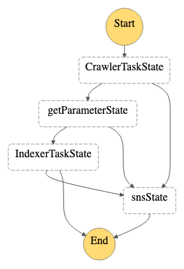

# awsdoc-ja-search

## Table of Contents

- [About](#about)
- [How it works](#howitworks)
- [Usage](#usage)

## About <a name = "about"></a>

Japanese AWS Document search by Algolia.  

## How it works <a name = "howitworks"></a>

### Frontend

Hosted on the following url. This site is generated by Amplify console.  
https://awsdoc-ja-search.ohajun.com/ 

### Create Algolia index

It runs the following AWS Step Function state machine by CloudWatch Events rule (Cron).

- `CrawlerTask` is Fargate task which crawls all AWS Documents
- `GetParameter` is Lambda function which passes result of `CrawlerTask`
- `IndexerTask` is Fargate task which creates Algolia index



## Usage <a name = "usage"></a>

### Create resources by CDK.

```
$ cd cdk
$ cdk deploy AwsDocSearchStack -c s3BucketName=<s3 bucket> -c s3Prefix=<s3 prefix> -c semaphore=<semaphore>
```

### Create Algolia index

This is current settings of aws doc index. Use [algolia-cli](https://github.com/algolia/algolia-cli#usage).

```json
$ algolia getsettings -a <algoliaAppId> -k <algoliaApiKey> -n <algoliaIndexName> | jq -r .
{
  "minWordSizefor1Typo": 4,
  "minWordSizefor2Typos": 8,
  "hitsPerPage": 20,
  "maxValuesPerFacet": 100,
  "version": 2,
  "attributesToIndex": [
    "unordered(content)"
  ],
  "numericAttributesToIndex": null,
  "attributesToRetrieve": [
    "crawled_at",
    "guide",
    "last_modified",
    "product",
    "title",
    "url"
  ],
  "unretrievableAttributes": null,
  "optionalWords": null,
  "queryLanguages": [
    "ja",
    "en"
  ],
  "attributesForFaceting": [
    "guide",
    "product"
  ],
  "attributesToSnippet": [
    "content:100"
  ],
  "attributesToHighlight": [],
  "paginationLimitedTo": 1000,
  "attributeForDistinct": null,
  "exactOnSingleWordQuery": "word",
  "ranking": [
    "typo",
    "geo",
    "words",
    "filters",
    "proximity",
    "attribute",
    "exact",
    "custom"
  ],
  "customRanking": [
    "desc(content)",
    "desc(product)"
  ],
  "separatorsToIndex": "!#()[]{}*+-_一,:;<>?@/\\^|%&~",
  "removeWordsIfNoResults": "none",
  "queryType": "prefixLast",
  "highlightPreTag": "<em>",
  "highlightPostTag": "</em>",
  "snippetEllipsisText": "....",
  "alternativesAsExact": [
    "ignorePlurals",
    "singleWordSynonym"
  ],
  "indexLanguages": [
    "ja",
    "en"
  ]
}
```


## License Summary

This project is made available under the MIT license. See the LICENSE file.
